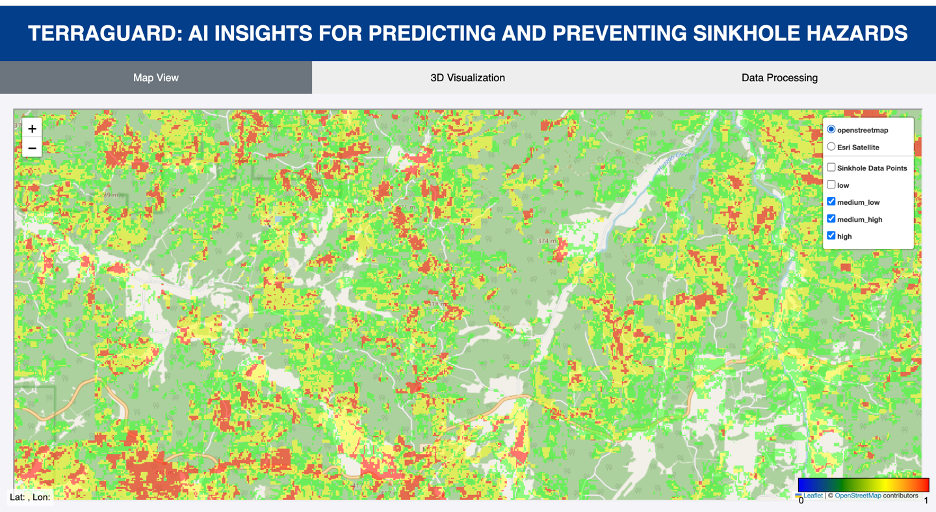
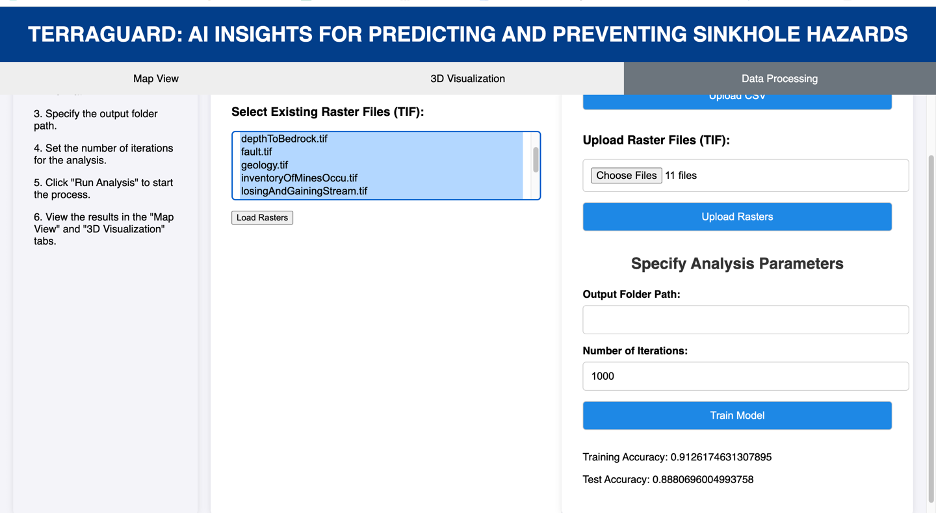

---

# TerraGuard

TerraGuard is an interactive web application designed to predict and prevent sinkhole hazards using advanced machine learning and geospatial data analysis. Developed as part of the Hackbox Challenge, TerraGuard leverages the power of AI to provide real-time risk assessments and early warnings, enhancing community safety and proactive risk management.

## Table of Contents

- [Introduction](#introduction)
- [Features](#features)
- [Technologies Used](#technologies-used)
- [Project Structure](#project-structure)
- [Installation](#installation)
- [Usage](#usage)
- [Contributing](#contributing)
- [License](#license)
- [Acknowledgments](#acknowledgments)

## Introduction

Sinkholes pose a significant risk to infrastructure and human safety. TerraGuard aims to address this issue by providing a robust and user-friendly platform for predicting and preventing sinkhole occurrences. By integrating geospatial data and machine learning models, TerraGuard offers accurate risk assessments and real-time monitoring capabilities.

**Website:** [https://terraguard.azurewebsites.net/](https://terraguard.azurewebsites.net/)

## Features

- **Real-Time Risk Assessment**: Provides real-time predictions of sinkhole risks based on current geospatial data.
- **Interactive Map**: Displays risk assessments on an interactive map, allowing users to visualize potential hazards.
- **Early Warning System**: Sends notifications and alerts to users about potential sinkhole threats.
- **User-Friendly Interface**: Intuitive design makes it easy for users to interact with the application and understand the risk levels.
- **Data Integration**: Combines multiple data sources, including geological surveys and environmental data, to enhance prediction accuracy.

## Technologies Used

- **Python**: Backend development and machine learning model implementation.
- **JavaScript**: Frontend development for interactive features.
- **HTML/CSS**: User interface design.
- **Flask**: Web framework for developing the application.
- **Azure Machine Learning**: For training and deploying machine learning models.
- **Azure Blob Storage**: For storing large datasets and model artifacts.
- **Azure Web App**: For hosting and deploying the web application.
- **Folium**: For creating interactive maps in Python.
- **Cesium**: For advanced 3D geospatial visualization.
- **Machine Learning**: Algorithms for predictive modeling.
- **Geospatial Analysis**: Techniques for analyzing and visualizing geospatial data.

## Project Structure

```plaintext
.
├── .github/workflows         
├── static                    
│   └── script.js            
├── templates                 
│   └── index.html           
├── LICENSE.txt              
├── TerraGuard_Hackbox_Presentation.pdf 
├── app.py                    
├── conda_env.yml            
├── del_service.py            
├── deploy_model.py          
├── environment.yml           
├── inference.py              
├── register_model.py        
├── requirements.txt          
├── train.py                 
├── train_model_with_azure_ml.py 
└── utils.py             
```

## Installation

### Prerequisites

- **Python 3.7+**
- **Conda** (recommended for environment management)
- **Azure Account** (for deploying the application)

### Steps

1. **Clone the repository:**

    ```bash
    git clone https://github.com/omuili/terraguard.git
    cd terraguard
    ```

2. **Create and activate a conda environment:**

    ```bash
    conda env create -f conda_env.yml
    conda activate terraguard
    ```

3. **Install the required Python packages:**

    ```bash
    pip install -r requirements.txt
    ```

4. **Set up Azure services:**

    Follow the instructions in `deploy_model.py` and `register_model.py` to set up the necessary Azure services for deployment.

5. **Run the application:**

    ```bash
    python app.py
    ```

    The application should now be running at `http://localhost:5000`.

## Usage

### Training the Model

To train the machine learning model, use the `train.py` script:

```bash
python train.py
```

For training with Azure ML, use the `train_model_with_azure_ml.py` script:

```bash
python train_model_with_azure_ml.py
```

### Deploying the Model

Deploy the trained model using the `deploy_model.py` script:

```bash
python deploy_model.py
```

### Running Inference

To run inference with the deployed model, use the `inference.py` script:

```bash
python inference.py
```

### Interactive Map

Access the interactive map by navigating to `http://localhost:5000` in your web browser or visit the deployed application at [https://terraguard.azurewebsites.net/](https://terraguard.azurewebsites.net/). Use the map to view real-time risk assessments and receive alerts for potential sinkhole hazards.

### Application Interface



### Data Processing Page



## Contributing

Contributions are welcome! Please read the [contributing guidelines](CONTRIBUTING.md) for more information on how to get involved in the project.

## License

This project is licensed under the MIT License. See the [LICENSE.txt](LICENSE.txt) file for details.

## Acknowledgments

- **Microsoft Innovation Challenge 2024**: For providing the platform and inspiration for this project.
- **Microsoft Azure**: For cloud services and support.
- **Open Source Community**: For the tools and libraries that made this project possible.

---
